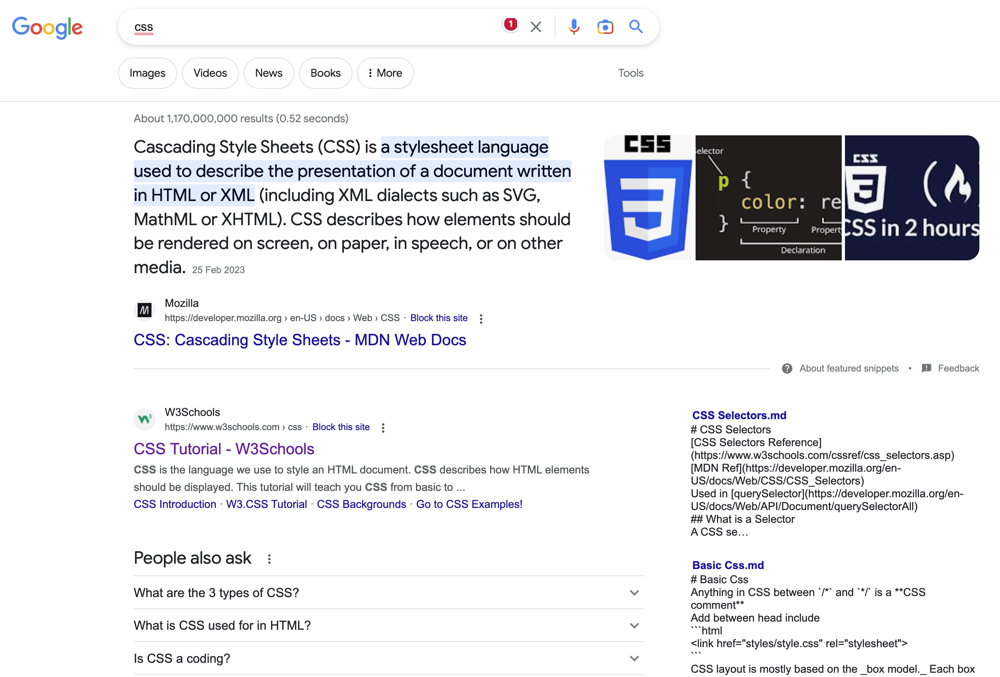
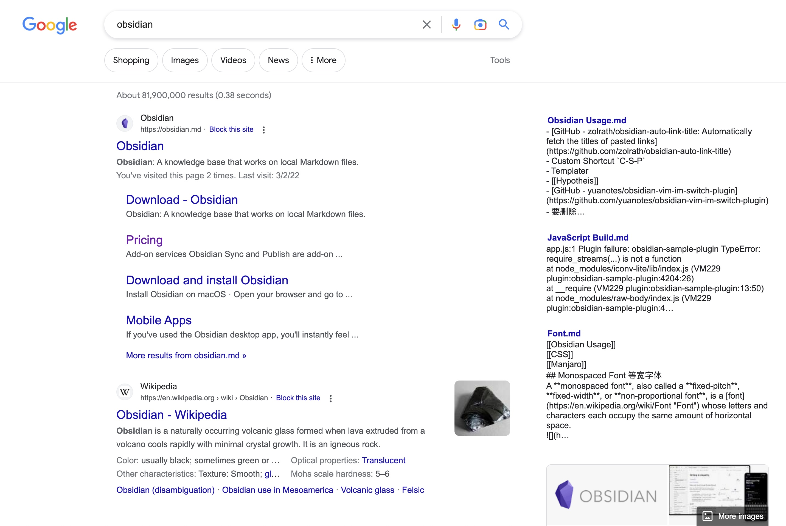

# Search Obsidian in Google

## What is this?
This is a simple plugin that allows you to search Obsidian in Google.

## How to use
1. Install [Chrome extension](https://chrome.google.com/webstore/detail/search-obsidian-in-google/dkefnggaipjamcbnjdlapgilhlaikbme) in Chrome. ([GitHub Source](https://github.com/qazxcdswe123/search-obsidian-browser-extension))
2. Install [Obsidian Omnisearch](https://github.com/scambier/obsidian-omnisearch) plugin in Obsidian, configure the plugin as you like.
3. Install [Search Obsidian in Google](https://github.com/qazxcdswe123/search-obsidian-in-google) plugin in Obsidian.
4. Configure the plugin in Obsidian, set the port number, authentication token, and the vault name in the Chrome extension.

- By the way, you can **click the search result** to open the file in Obsidian! This requires you to set the vault name in the Chrome extension. It is recommended to check `Always allow www.google.com to open links of this type in the associated app ` in the popup window.

### Configuration
- Obsidian Plugin
  - Port: The port number of the local REST API between Obsidian and Chrome extension. Default is `27080`.
- Chrome Extension
  - Local Port: This should match the port number in Obsidian plugin.
  - Token: The authentication token between Obsidian and Chrome extension. You can find it in Obsidian plugin settings page.
  - Vault Name (Optional): Used when you want to click the search result to open the file in Obsidian. You can find the name by clicking the vault icon in the bottom left corner of Obsidian.

### Install manually
Since the plugin is still under [review](https://github.com/obsidianmd/obsidian-releases/pull/1823), you can install it manually.
1. Download the latest release from [here](https://github.com/qazxcdswe123/search-obsidian-in-google/releases/tag/1.0.0)
2. Open the plugin folder in Obsidian, create a folder named `search-obsidian-in-google` and put the `main.js`, `manifest.json`, and `index.css` in it.
3. Install [Chrome extension](https://chrome.google.com/webstore/detail/search-obsidian-in-google/dkefnggaipjamcbnjdlapgilhlaikbme) in Chrome, configure it properly.
4. Install [OmniSearch](https://github.com/scambier/obsidian-omnisearch) plugin in Obsidian, configure the plugin as you like.

## Demo

## Credits
- [Omnisearch](https://github.com/scambier/obsidian-omnisearch)
- [Obsidian-local-rest-api](https://github.com/coddingtonbear/obsidian-local-rest-api/)
- [Chatgpt-google-extension](https://github.com/wong2/chatgpt-google-extension)